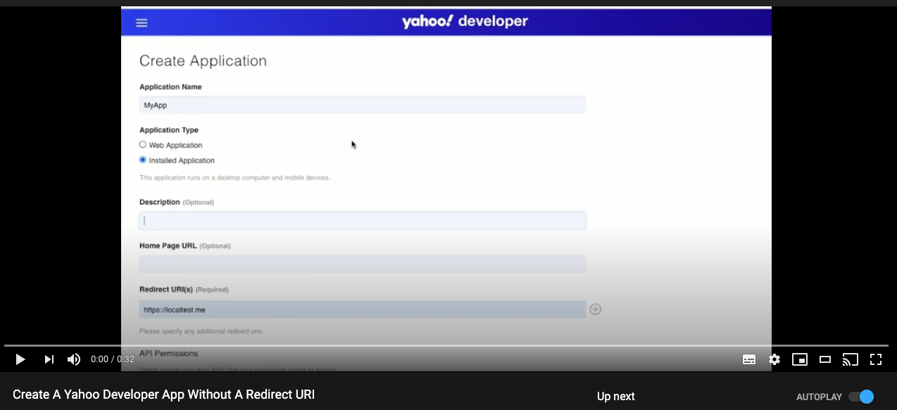
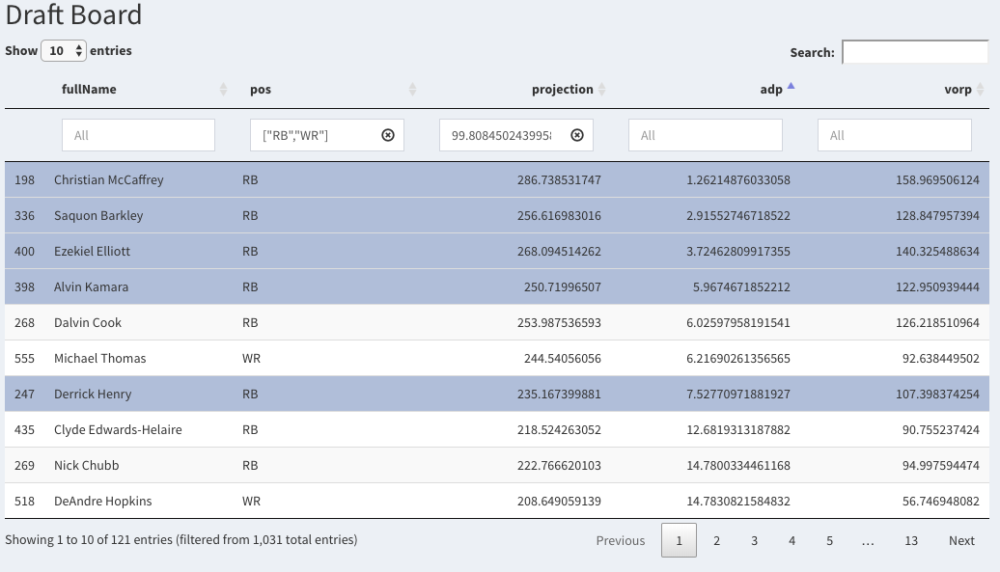

# fantasy-football-viz
Fantasy football metrics and visualization project using R Shiny. 

# API Connection
The first step of this project was to connect to the Yahoo and ESPN APIs. Since we're focused on player analytics, connecting to Yahoo's API ended up being a bit of a bust, since they don't give out player projection data (it's through a third party). ESPN's API is undocumented, but through some research it's accessible and does include player data. I added private league support by including two login-related cookies in the GET calls to the API.

For privacy's sake, I didn't include the files with my league IDs, Yahoo developer credentials, or ESPN cookies, but they're simple text files with one ID/credential/cookie per line.

Here's a short video I made on how to create a Yahoo Developer App without a redirect URI:

# Shiny App
After getting connected to the API, I started out with a barebones Shiny App, pulling a couple of features from the ESPN API and using those to create an interactive table.

# Custom Metrics
My first idea for a unique player metric was a simple VORP (Value Over Replacement Player) metric. I defined a replacement player as the worst starter by projected seasonal point total by position. With a 12 team league, that'd be the 12th best Tight End. I made a naive assumption that flex players would be split evenly between running backs and wide receivers, so in a 2WR/2RB/1FLEX league I set the replacement level player to be the 36th best RB and 36th best WR. This allowed me to see the value that top tier players had over their peers and tracked pretty well with the average draft position metric. It also confirmed an oft-repeated notion about quarterbacks; their overall points scored may be higher, but the variance of their scoring is less dramatic than other positions.
